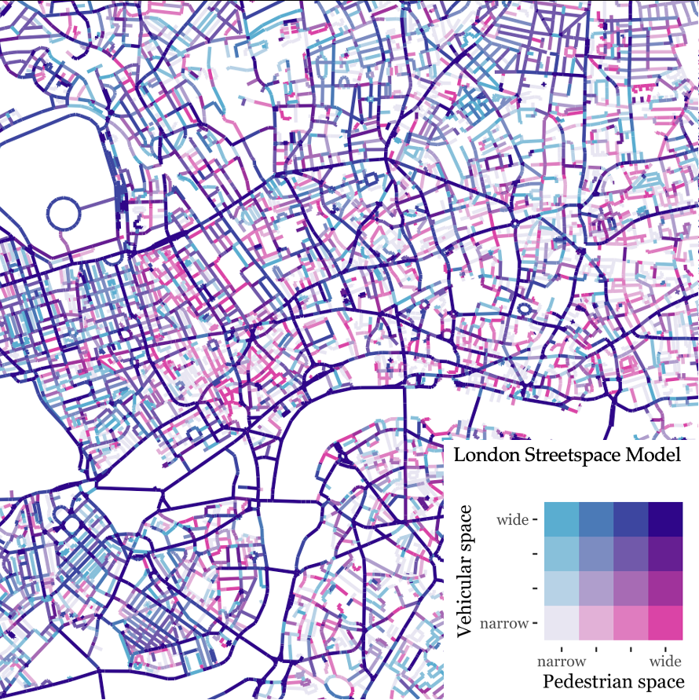

# Streetspace dataset London

This page describes the technical specifications of the streetspace allocation dataset for London. The data is presented as geometric linear features representing the road centre line of streets.

- [Methodology](https://github.com/npalomin/streetspace_dataset_ldn#methodolgy)

- [Codebook](https://github.com/npalomin/streetspace_dataset_ldn#codebook)

- [Format](https://github.com/npalomin/streetspace_dataset_ldn#format)

- [Study Area](https://github.com/npalomin/streetspace_dataset_ldn#study-area)

- [Caveats](https://github.com/npalomin/streetspace_dataset_ldn#caveats)

- [Related research](https://github.com/npalomin/streetspace_dataset_ldn#related-research)

- [Possible uses and applications](https://github.com/npalomin/streetspace_dataset_ldn#possible-uses-and-applications)

- [Data accessibility](https://github.com/npalomin/streetspace_dataset_ldn#data-accessibility)

- [Citation](https://github.com/npalomin/streetspace_dataset_ldn#citation)

- [Contact](https://github.com/npalomin/streetspace_dataset_ldn#contact)

## Methodology

The complete methodology is presented in the CASA Working Paper 212 ["Quantifying and Mapping Streetspace: a Geocomputational Method for the Citywide Analysis of Pedestrian and Vehicular Streetspace"](https://www.ucl.ac.uk/bartlett/casa/publications/2019/sep/casa-working-paper-212) by Nicolas Palominos and Duncan A Smith published in September 2019. The dataset is generated through a processing model using QGIS and R softwares. Metrics of pavement and carriageway widths are derived from urban topographic data published for research purposes by Ordnance Survey (OS) under a Digimap Licence. 

## Codebook

| Variable name | Variable description |
|----|----|
|id | Unique identifier |
|DISTNAME | Street name |
|ROADNUMBER | Street code |
|CLASSIFICA | Street classification (see [OS Road type](https://www.ordnancesurvey.co.uk/xml/codelists/map/RoadClassificationTypeOML.xml) codelist)|
|foW | Aggregated footway width (both pavements added) see methodology for details |
|caW | Carriageway widths |
|toW | Total street widths |

## Format

The dataset is provided in a geopackage format (gpkg).

The data can be analysed using the free software environment R with the [sf](https://cran.r-project.org/web/packages/sf/index.html) package or the free and open-source software [QGIS](https://qgis.org/en/site/)

## Study area

The dataset describes all streets within an area of a 2 km buffer from the M25 Orbital Motorway road centre line.

## Caveats

The parameters presented in this dataset should be viewed as estimated measurements of real-world-objects. For a full assessment of the data generation process users are advised to review the referenced [paper](https://www.ucl.ac.uk/bartlett/casa/publications/2019/sep/casa-working-paper-212). Some known limitations are present in the measurements of bridges structures and in motorways junctions where streetspace designations could be over and underestimated. Other inconsistencies observed in the data have to do with the capacity of the datasets to synchronously reflect the ongoing changing nature of the built environment. The Topographic layer data was dowloaded on May 2017.

## Related research

This dataset was created by [Nicolas Palominos](https://npalomin.github.io/) for research purposes during the development of his PhD thesis at the Centre for Advanced Spatial Analysis, University College London. The thesis is under the supervision of Dr Duncan A Smith and Dr Sam Griffiths.

|Research Publication| Type | |
|--|--|--|
|Citywide analysis of streetspace in London |[Conference presentation](https://www.researchgate.net/publication/337745659_Citywide_analysis_of_streetspace_in_London?channel=doi&linkId=5de83ad9299bf10bc34049c8&showFulltext=true#fullTextFileContent) |3rd INTERNATIONAL LAND USE SYMPOSIUM. Land use changes: Trends and projections |
|Streetspace designation metrics |[Poster presentation](https://drive.google.com/file/d/1RwEJdtj4UGNIczO6PAgMO89gK3Xps9Qn/view) |London Walking and Cycling conference 2019 |

## Possible uses and applications

The new street level data introduced here can yield important insights for street research, planning and design. 

Under the coronavirus emergency, public authorities are being required to reorganise streespace to facilitate social distancing and promote less polluting modes of transport. Because the available streetspace is scarce and fixed, the widths of pavements and carriageways are key parameters to consider for re-designing streets with a health-oriented layout. Pavement and carriageway widths can be queried from highly detailed built environment topographic data. However, the data structure limits its analysis to small urban areas being less useful for city-wide planning. The dataset on streetspace parameters presented here allow to conduct spatial analysis over large urban areas using free and open-source software. The examination of this dataset can offer valuable analytical capacity for designing and planning streets following principles of sustainable city development.

## Data accessibility

Data are available from Zenodo: 

## Citation

Cite working paper as:

APA

Palominos, N., & Smith, D. A. Quantifying and Mapping Streetspace: a Geocomputational Method for the Citywide Analysis of Pedestrian and Vehicular Streetspace. CASA Working Paper 212. Sep 2019.

Bibtex

@article{palominos_quantifying_2019,
    series = {{CASA} {Working} {Paper} 212},
    title = {Quantifying and {Mapping} {Streetspace}: a {Geocomputational} {Method} for the {Citywide} {Analysis} of {Pedestrian} and {Vehicular} {Streetspace}},
    issn = {1467-1298},
    url = {https://www.ucl.ac.uk/bartlett/casa/sites/bartlett/files/casa_working_paper_-_212.pdf},
    language = {en},
    author = {Palominos, Nicolas and Smith, Duncan A},
    month = sep,
    year = {2019},
    pages = {21}
}

## Contact

For enquiries contact Nicolas Palominos at n.palominos.16@ucl.ac.uk
